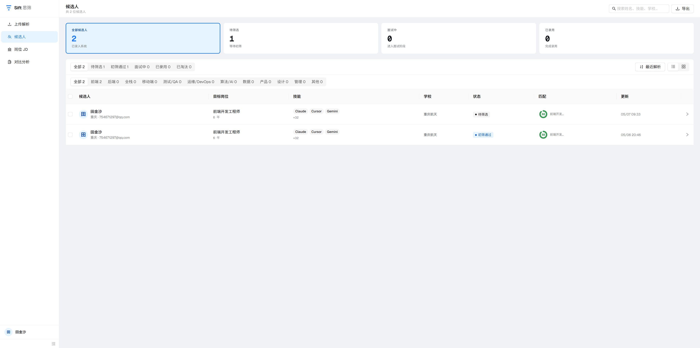
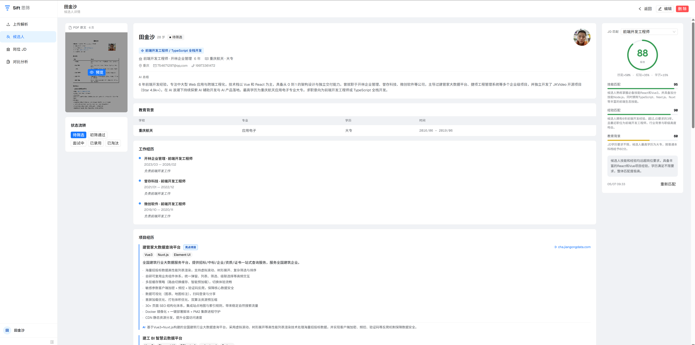
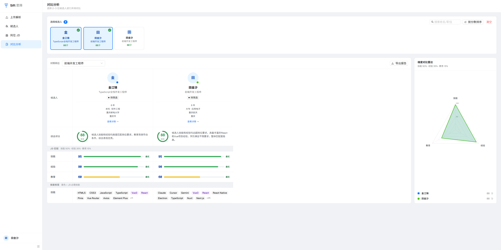
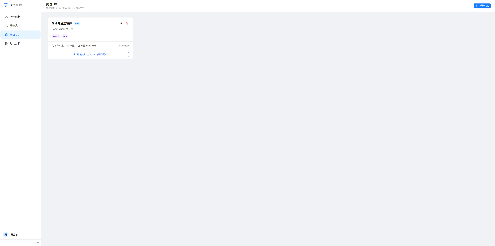

<div align="center">

# Sift 思筛

**AI 驱动的简历筛选与岗位匹配平台**

让 AI 在 30 秒内读完 100 份简历,告诉你哪几位值得见。

[](./LICENSE)
[](https://nextjs.org/)
[](https://www.typescriptlang.org/)
[](https://github.com/tiajinsha/resume-agent-next/actions/workflows/ci.yml)


</div>

## 📸 预览

### 候选人列表 — KPI / 状态筛选 / 批量操作 / CSV 导出


### 候选人详情 — AI 流式抽取(打字机效果)+ JD 匹配抽屉


### 多人对比 — 自研 SVG 雷达图 + 维度评分 + 技能差异高亮


### 岗位描述编辑 — 必备技能 / 加分项 / 三维度权重配置


---

## ✨ 特性

- 📄 **PDF 上传 → AI 流式解析** — 候选人详情页打字机效果实时呈现 AI 抽取过程
- 🎯 **三维度 JD 匹配评分** — 技能 / 经验 / 教育独立打分,JD 自定义权重综合
- 🪞 **2-3 位候选人并排对比** — 自研 SVG 雷达图,自动高亮 JD 必需技能与候选人独有技能
- 📊 **精装候选人列表** — KPI 卡片可点筛选、行内状态修改、批量操作、搜索高亮、CSV 导出
- 🔄 **SSE 实时推送 + 失败重试** — 提取过程跨页面刷新可秒级追上当前进度
- 🔐 **完整账号体系** — 用户隔离、HttpOnly session cookie + 7 天滚动续期、应用层速率限制
- 🐳 **多种部署方式** — Docker Compose 一键起、阿里云一键脚本、本地 dev 三种姿势

## 🧱 技术栈

| 层 | 技术 |
|---|---|
| 框架 | Next.js 16 (App Router, RSC + Client) |
| 前端 | React 19、TypeScript strict、antd v6、@ant-design/icons v6 |
| 后端 | Node.js 20、API Routes、SSE 流式响应 |
| 数据库 | SQLite (better-sqlite3, WAL) + Drizzle ORM |
| AI | DeepSeek (流式 JSON,OpenAI SDK 兼容) |
| 测试 | Vitest |
| 部署 | Docker / PM2 / Nginx |

## 🚀 快速开始 (本地开发)

需要 Node 20+。

```bash
# clone + install
git clone https://github.com/tiajinsha/resume-agent-next.git
cd resume-agent-next
npm install

# 配 env (从 https://platform.deepseek.com 获取 key)
cp .env.local.example .env.local
# 编辑 .env.local 填 DEEPSEEK_API_KEY,或设 LLM_STUB=1 跳过真实 LLM

# 建库 + 启动
npm run db:migrate
npm run dev
# → http://localhost:3000
```

第一次进入 `/login` 注册账号开始用。

## 🐳 部署

### 方式 A:Docker Compose (推荐)

```bash
# 配 .env.production
cp .env.local.example .env.production
# 填入 DEEPSEEK_API_KEY

# 起服务
docker compose up -d --build

# 看状态
docker compose ps
docker compose logs -f sift

# 访问 http://localhost:3000
```

数据持久化在 `sift-data` 命名 volume,`docker compose down` 不会丢数据,完全清理用 `docker compose down -v`。

### 方式 B:阿里云 / VPS 一键脚本

适合 Alibaba Cloud Linux / CentOS / RHEL 系发行版:

```bash
# 上服务器
ssh root@<your-server-ip>

# 拉脚本(可先 review 一下)
curl -fsSL https://raw.githubusercontent.com/tiajinsha/resume-agent-next/main/bootstrap-server.sh -o /root/bootstrap.sh
bash /root/bootstrap.sh

# 完成后填入 DEEPSEEK_API_KEY
sed -i 's|^DEEPSEEK_API_KEY=.*|DEEPSEEK_API_KEY=sk-your-key|' /opt/sift/.env.local
pm2 restart sift --update-env
```

脚本会自动装 Node 20 + Nginx + PM2,clone 代码,build,启动,反代 80 → 3000。详见 [`bootstrap-server.sh`](./bootstrap-server.sh)。

### 方式 C:本地构建 + 上自己的服务器

```bash
npm run build              # 产出 .next/standalone
npm run start              # 或 PM2 / systemd 起 node server.js
```

## 🏗 架构

```
浏览器
  │
  └─ Next.js App Router (RSC + Client Components)
       │
       ├─ /api/upload          PDF → 队列 → 解析
       ├─ /api/candidates/...  CRUD + 状态 + 重试
       ├─ /api/.../stream      SSE 流式推送 AI 进度
       │
       └─ Server-side
            ├─ better-sqlite3 (WAL)  ←  Drizzle ORM
            ├─ p-queue (concurrency=1)  ←  AI 提取队列
            ├─ DeepSeek 流式 JSON  ←  best-effort-json-parser 增量解析
            └─ globalThis.* singletons  ←  HMR 安全
```

关键设计请见 [CLAUDE.md](./CLAUDE.md) 的 "架构概览" 段。

## 🗺 路线图

- [ ] **多 LLM 提供方支持** — OpenAI / Moonshot / 智谱 / 通义千问任选(目前只支持 DeepSeek)
- [ ] **简历去重** — MD5 / 内容相似度检测,避免同一份简历被重复处理
- [ ] **团队协作** — 多用户共享候选人池,评论/打分协作
- [ ] **导出功能扩展** — 候选人对比报告 PDF 导出 / 简历包打包下载
- [ ] **JD 库 + 模板** — 内置常见岗位 JD 模板,一键创建
- [ ] **Webhook 通知** — 简历处理完成后推送到飞书 / 钉钉 / Slack

欢迎提 [Feature Request](../../issues/new?template=feature_request.yml) 或直接 PR!

## 🤝 贡献

欢迎所有形式的贡献!请先看 [CONTRIBUTING.md](./CONTRIBUTING.md) 了解开发环境与提交规范。

简单流程:Fork → Branch → Code → `npm test` 通过 → PR → 等 review。

## 📄 License

[MIT](./LICENSE) © 2026 tiajinsha

---

<div align="center">
<sub>用 AI 把繁琐筛简历的时间还给招聘人 🎯</sub>
</div>
